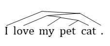

# Instructions for Dataset Construction

## Datasets (train/dev/test)
Datasets for training, developing and testing are in json, which should be named following the format of 
``$TASKNAME_$STAGE.json``.
For example, ``dbpedia_train.json``, ``dbpedia_dev.json`` and ``dbpedia_test.json``.

In a json file, each line denotes a training sample stored in Python dict. 

### Keys of a Training Sample
#### Sentence Classification
* ``sentence (str)``: tokenized sentence. Tokens are separated by spaces.
* ``label (int)``: label for classification. Note it should <b>start from 1</b> for our code to work well.
* ``constituency_tree_encoding (str)``: encoding of corresponding constituency tree, which is in the format of "left1, 
right1, father1, left2, right2, father2, ..." Leaf nodes are represented by 0~n-1. 
For example, encoding of the following tree should be:
"3,4,6,2,6,7,1,7,8,8,5,9,0,9,10". 

#### Sentence Relation Classification
* ``sentence_1 (str)``, ``sentence_2 (str)``: tokenized sentences. 
* ``sentence_1_binary_encoding``, ``sentence_2_binary_encoding``: encodings of corresponding parsing trees. 
* ``gold_label``: label for classification.

We apologize for the inconsistent names in the two types of classification tasks. 

#### Sentence Generation
* ``source_sentence (str)``: tokenized source sentence.
* ``target_sentence (str)``: tokenized target sentence.  
* ``parsed_source_sentence(str)``: encoding of corresponding constituency tree of source sentence. 

## Vocabularies
For vocabularies, just drop a list of words in a text file. One word per line. 

## Examples
This folder contains part of ``dbpedia_dev.json``, ``conj_dev.json`` and ``mt_dev.json``, as well as ``snli.vocab`` for 
reference. 